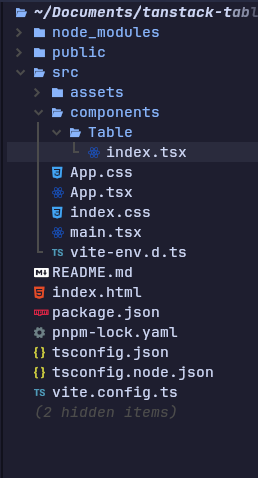
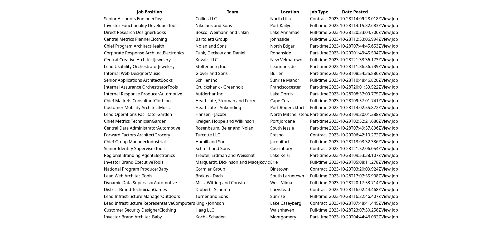
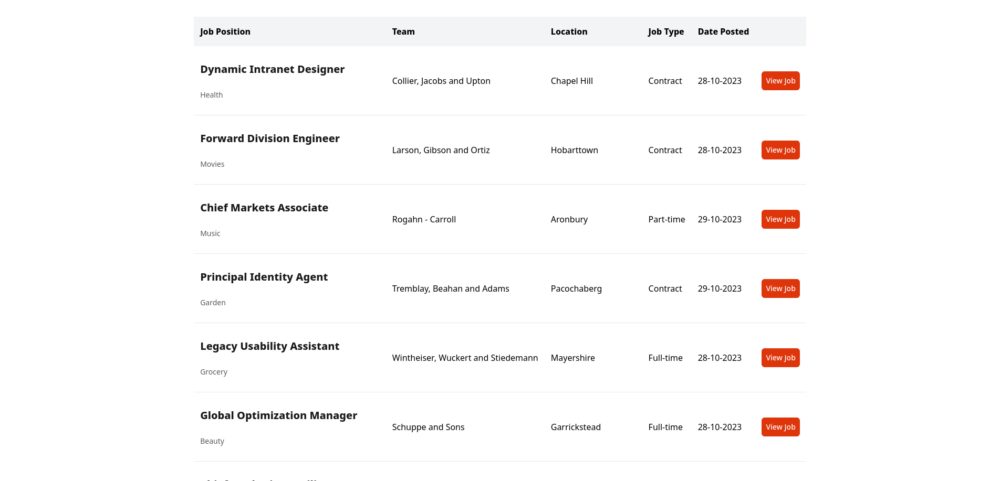

Many developers face the challenge of creating functional tables or datagrids that incorporate custom markup with distinct UI styling. Enter TanStack Table, a headless UI library designed to tackle this very problem. It's notable for being framework-agnostic and providing adapters for various front-end technologies like React, Vue, Svelte, and Solid. Equipped with built-in features like pagination, filtering, sorting, and SSR (Server-Side Rendering), it offers an extensive API for visualizing data in rows and columns. In this article, I’ll showcase to you the capabilities of TanStack Table v8 and guide you through setting up a table for yourself.

## Understanding the Core Primitives

There are some APIs you need to get familiar with before you move forward.

1. Rows - This is an array of objects defined by a column definition. Each row contains multiple cell properties that represent the data to be displayed on the table.
2. Columns - They're an array of column defs. This could be regarded as the schematic of your table.
3. Header groups - They are an array of columns. Each group contains an array of columns.
4. Row models - They're factory functions that compute the data structure for the table. It is invoked once for each table, creating a new function dedicated to calculating the specific row model for that table.
5. Column Defs - They're an object that shapes the data model, handling sorting, filtering, and grouping, while also determining table display for actions or visual elements

## Project Setup

First, we're going to install [TanStack Tables](https://tanstack.com/table/v8/) and other dependencies to bootstrap the project. For this guide, We'll be using React alongside TypeScript. Feel free to use any JS framework of your choice, as there are adapters provided for all.

With our terminal open, we'll run the following command to create a [Vite app](https://vitejs.dev/), change our current directory to the newly scaffolded project, and then install [TanStack Table](https://tanstack.com/table/v8/) as a dependency:

```bash
pnpm create vite tanstack-table-demo && cd tanstack-table-demo && pnpm add @tanstack/react-table
```

Next, we'll create a folder where we'll store our reusable table called `components`. Inside the newly created `components` folder, we'll also create another folder called `Table` along with an index file. Our current project's file tree should resemble the below:



We're going to leave the `Table` component as it is for now and come back to it later.

## Preparation of Row Data

We lack any data to populate the table, so let's proceed to create a function to do just that. For the purpose of this article, we'll write a helper function using [faker.js](https://fakerjs.dev/) to generate an array of fake data. I won't dive much into explaining the code in this section. Additionally, we'll develop a custom hook to emulate the process of fetching this simulated data. If you already have a data source available, you can skip this section.

I won't extensively delve into code explanations in this section. Let's install our new dependencies then shall we?

```bash
pnpm add axios
```

Here is the schema:

`hooks/types.ts`

```typescript
import z from "zod";

export const jobItem = z.object({
  id: z.number(),
  position: z.string(),
  industry: z.string(),
  team: z.string(),
  location: z.string(),
  job_type: z.string(),
  date_posted: z.string().datetime({ offset: true }),
});

export const jobs = z.object({
  results: z.array(jobItem),
});

export type JobItem = z.infer<typeof jobItem>;
export type Jobs = z.infer<typeof jobs>;
```

Here is our helper function:

`utils/generateRandomJobItem.ts`

```typescript
import { faker } from "@faker-js/faker";
import { jobItem } from "../hooks/types";

export const generateRandomJobItem = () => ({
  id: faker.number.int(),
  position: faker.person.jobTitle(),
  industry: faker.commerce.department(),
  team: faker.company.name(),
  location: faker.location.city(),
  job_type: faker.helpers.arrayElement(["Full-time", "Part-time", "Contract"]),
  date_posted: faker.date.recent().toISOString(),
});

export const generateJobItems = (n: number) => {
  const jobItems = [];
  for (let i = 0; i < n; i++) {
    const fakeJobItem = generateRandomJobItem();
    try {
      jobItem.parse(fakeJobItem);
      jobItems.push(fakeJobItem);
    } catch (error) {
      console.error(`Generated invalid job item: ${JSON.stringify(fakeJobItem)}`);
      console.error(error);
    }
  }
  return jobItems;
};
```

Below is our custom hook:

`hooks/useJobs.tsx`

```typescript
import { useState, useEffect } from "react";
import { Jobs } from "./types";
import { generateJobItems } from "../utils/generateRandomJobItem";

type Query<T> =
  | {
      data: T;
      isPending: false;
      isError: false;
    }
  | {
      data?: T;
      isPending: true;
      isError: false;
    }
  | {
      data?: undefined;
      isPending: false;
      isError: true;
    };

const useJobs = () => {
  const [query, setQuery] = useState<Query<Jobs>>({
    data: undefined,
    isPending: true,
    isError: false,
  });

  useEffect(() => {
    let ignore = false;

    const fetchData = async () => {
      try {
        await new Promise((resolve) => setTimeout(resolve, 1000));
        const data = {
          results: generateJobItems(15),
        };
        if (!ignore) {
          setQuery({ data, isPending: false, isError: false });
        }
      } catch (error) {
        if (!ignore) {
          setQuery({ data: undefined, isPending: false, isError: true });
        }
      }
    };
    fetchData();

    return () => {
      ignore = true;
    };
  }, []);

  return query;
};

export default useJobs;
```

## Defining Table Schema with Column Defs

Let's proceed to import and call `createColumnHelper` with a row type, which returns a utility we can use to create different column definition types. This utility object helps us achieve the highest possible level of type safety when defining our table columns. Also by 'row type,' I'm referring to the type definition of the objects that make up our data array.

`data/columns.tsx`

```typescript
import { createColumnHelper } from "@tanstack/react-table";
import { JobItem } from "../hooks/types";

const columnHelper = createColumnHelper<JobItem>();
```

Now, we can create our columns to complete our table schema. There are three unique ways to define data columns namely using array indices, object keys, or accessor functions. We'll define each column object using an `accessor()` function.

```typescript
export const columns = [
  columnHelper.accessor("position", {
    id: "position",
    header: "Job Position",
    cell: (info) => (
      <div className="flex flex-col gap-6">
        <span className="text-[#1A1A1A] text-xl font-bold leading-[30px]">
          {info.getValue()}
        </span>
        <span className="text-[#595959] text-sm font-normal leading-[21px]">
          {info.row.original.industry}
        </span>
      </div>
    ),
  }),
  columnHelper.accessor("team", {
    id: "team",
    header: "Team",
    cell: (info) => info.getValue(),
  }),
  columnHelper.accessor("location", {
    id: "location",
    header: "Location",
    cell: (info) => info.getValue(),
  }),
  columnHelper.accessor("job_type", {
    id: "job_type",
    header: "Job Type",
    cell: (info) => info.getValue(),
  }),
  columnHelper.accessor("date_posted", {
    id: "date_posted",
    header: "Date Posted",
    cell: (info) => info.getValue(),
  }),
  columnHelper.accessor("id", {
    id: "view_job",
    header: "",
    cell: (info) => (
      <a
        href={`${location.pathname}${info.getValue()}/`}
        className="bg-primary p-2 text-white text-primary-foreground hover:bg-primary/90 inline-flex min-w-fit
        items-center justify-center rounded-md text-sm font-medium ring-offset-background
        transition-colors focus-visible:outline-none focus-visible:ring-2
        focus-visible:ring-ring focus-visible:ring-offset-2 disabled:pointer-events-none
        disabled:opacity-50"
      >
        View Job
      </a>
    ),
  }),
];
```

In our column definitions, we provided a custom cell formatter by passing a function to the `cell` property to create a unique markup layout. By doing this, it allows us to access the cell's value and other key properties like `row`, `table`, `column` etc. While we explicitly defined the `id` for each column, it's worth noting that this is automatically generated from the `accessor` name if none is provided, thus eliminating the need for manual specification on our part.

## Building a Reusable Table Component

In this section, we'll leverage the Table core APIs to create a composite component, easily adaptable for various use cases across our application by passing the necessary states as props. This table component will expect `data` as a prop, which is an array of generic type `TData`, and `columns` as a prop, an array of `ColumnDef` requiring two arguments, one of which is also of type `TData`.

`components/Table/index.tsx`

```typescript
import {
  ColumnDef,
  flexRender,
  getCoreRowModel,
  useReactTable,
} from "@tanstack/react-table";

type TableProps<TData> = {
  // eslint-disable-next-line @typescript-eslint/no-explicit-any
  columns: ColumnDef<TData, any>[];
  data: TData[];
};

const Table = <TData,>({ columns, data }: TableProps<TData>) => {
  const table = useReactTable({
    data,
    columns,
    getCoreRowModel: getCoreRowModel(),
  });

  return (
    <></>
  );
};

export default Table
```

A table object is created using the `useReactTable` with the data, columns and `getCoreRowModel`. These three properties are the defaults we need to define a table. The `getCoreRowModel` is a required default that returns a function that calculates and returns the row model for the table as mentioned the earlier part of this article

We make a table using `useReactTable` with three basic properties: `data`, `columns`, and `getCoreRowModel`. These are the default properties for setting up a table. `getCoreRowModel` is a required part that gives us a function to compute and provide the row model for the table, as we talked about earlier in this article

You must be wondering why we're using the forbidden type annotation `any` for our props interface. This is because there's an ongoing [TypeScript issue](https://github.com/TanStack/table/issues/4382) with the current version `8.10` of TanStack Tables which prevents passing columns as props to any component with an explicit type. While this issue is yet to be resolved, this is the only way to combat the problem.

Now, let's return to our `Table` component and add the following elements to our return statement.

`components/Table/index.tsx`

```typescript
  return (
    <>
      <table>
        <thead>
          {table.getHeaderGroups().map((headerGroup) => (
            <tr key={headerGroup.id}>
              {headerGroup.headers.map((header) => (
                <th key={header.id}>
                  {header.isPlaceholder
                    ? null
                    : flexRender(
                        header.column.columnDef.header,
                        header.getContext(),
                      )}
                </th>
              ))}
            </tr>
          ))}
        </thead>
        <tbody>
          {table.getRowModel().rows.map((row) => (
            <tr key={row.id}>
              {row.getVisibleCells().map((cell) => (
                <td key={cell.id}>
                  {flexRender(cell.column.columnDef.cell, cell.getContext())}
                </td>
              ))}
            </tr>
          ))}
        </tbody>
      </table>
    </>
  );
```

We perform two iterations to display our header titles. First, we loop through `getHeaderGroups()` to gather our categorized headers, if we have multiple. Then, we map over these header groups to retrieve our headers for each column, along with their cell and context values. Usually, we can render our header using `getValue()` or `renderValue()`, but because we're using a custom markup from our column's cell, we need to use our framework's `flexRender` utility.

We follow a similar approach for our `<tbody>`, which comprises rows with table cells. For every row obtained from `getRowModel()`, we iterate over the cells and generate a `<td>` element for each. Within each `<td>`, we utilize the `flexRender` function to render the cell element with the custom markup.

To display our newly created `Table` component, we'll import and render it to our desired component of choice. In the case of this article, that will be `App.tsx`

`App.tsx`

```typescript
import useJobs from "./hooks/useJobs";
import Table from "./components/Table";
import { columns } from "./data/columns";

function App() {
  const query = useJobs();

  return (
    <div className="my-8 container mx-auto">
      {!query.isPending && !query.isError && (
        <Table data={query.data?.results} columns={columns} />
      )}
    </div>
  );
}

export default App;
```

If we run our project server and check our browser, we should be able to see our rendered table.



## Applying Styling with Tailwind CSS

We have a functioning table but it doesn't look very appealing to the eyes. What if we wanted to add custom styling? Well, we can do very so because [TanStack](https://tanstack.com/table/v8/) is [**_headless_**](https://tanstack.com/table/v8/docs/guide/introduction#what-is-headless-ui), thus it doesn't provide any opinionated styling by default. This removes the need to dig through the docs to overwrite styles as there are none. For this section, I'll be using [Tailwind CSS](https://tailwindcss.com/). Feel free to use your preferred styling library of choice, or even opt for vanilla CSS if you prefer.

In the `Table` folder, let's create a CSS module named `index.module.css` . Defining the styles outside the returned JSX template makes the component code less cluttered IMO.

`components/Table/index.module.css`

```css
.tableHead {
  @apply bg-gray-100 px-2.5 py-[14px] text-left 2xl:px-3 2xl:py-4;
}

.tableBody {
  @apply border-b border-gray-200 px-2.5 py-[25px] 2xl:px-3 2xl:py-7;
}
```

Next, we can then import our defined stylesheet into our `Table` component.

`components/Table/index.tsx`

```typescript
import styles from "./index.module.css"

type TableProps<TData> = {
  ...
};

const Table = <TData,>({ columns, data }: TableProps<TData>) => {
  const table = useReactTable({
    ...
  });

  return (
    <>
      <table>
        <thead>
          {table.getHeaderGroups().map((headerGroup) => (
            <tr key={headerGroup.id}>
              {headerGroup.headers.map((header) => (
                <th
                  key={header.id}
                  className={styles.tableHead}
                >
                  ...
                </th>
              ))}
            </tr>
          ))}
        </thead>
        <tbody>
          {table.getRowModel().rows.map((row) => (
            <tr key={row.id}>
              {row.getVisibleCells().map((cell) => (
                <td
                  key={cell.id}
                  className={styles.tableBody}
                >
                  ...
                </td>
              ))}
            </tr>
          ))}
        </tbody>
      </table>
    </>
  );
};
```

For our columns, we can define our styles in line.

`data/columns.tsx`

```typescript
import { createColumnHelper } from "@tanstack/react-table";
import { JobItem } from "../hooks/types";

const columnHelper = createColumnHelper<JobItem>();

export const columns = [
  columnHelper.accessor("position", {
    id: "position",
    header: "Job Position",
    cell: (info) => (
      <div className="flex flex-col gap-6">
        <span className="text-[#1A1A1A] text-xl font-bold leading-[30px]">
          {info.getValue()}
        </span>
        <span className="text-[#595959] text-sm font-normal leading-[21px]">
          {info.row.original.industry}
        </span>
      </div>
    ),
  }),
  columnHelper.accessor("team", {
    id: "team",
    header: "Team",
    cell: (info) => info.getValue(),
  }),
  columnHelper.accessor("location", {
    id: "location",
    header: "Location",
    cell: (info) => info.getValue(),
  }),
  columnHelper.accessor("job_type", {
    id: "job_type",
    header: "Job Type",
    cell: (info) => info.getValue(),
  }),
  columnHelper.accessor("date_posted", {
    id: "date_posted",
    header: "Date Posted",
    cell: (info) => info.getValue(),
  }),
  columnHelper.accessor("id", {
    id: "view_job",
    header: "",
    cell: (info) => (
      <a
        href={`${location.pathname}${info.getValue()}/`}
        className="bg-primary p-2 text-white text-primary-foreground hover:bg-primary/90 inline-flex min-w-fit
        items-center justify-center rounded-md text-sm font-medium ring-offset-background
        transition-colors focus-visible:outline-none focus-visible:ring-2
        focus-visible:ring-ring focus-visible:ring-offset-2 disabled:pointer-events-none
        disabled:opacity-50"
      >
        View Job
      </a>
    ),
  }),
];
```

Congratulation!!! If you've gotten this far, our `Table` component should now be styled and look attractive.



## Introducing Pagination

We're going to look into adding pagination to improve the table's usability further. To do this, we'll organize the pagination components into one folder with respective child components. Although the code for creating these components may seem convoluted, doing this makes our pagination very composable and maintainable. Let's start by creating our pagination button.

`Table/Pagination/PaginateButton.tsx`

```typescript
import { Table } from "@tanstack/react-table";

type PaginateButtonProps<T> = {
  table: Table<T>;
} & (
  | {
      direction: "specific";
      page: number;
    }
  | {
      direction: "next" | "previous" | "first" | "last";
    }
);

const PaginateButton = <T,>(props: PaginateButtonProps<T>) => {
  if (
    props.direction === "next" ||
    props.direction === "previous" ||
    props.direction === "first" ||
    props.direction === "last"
  ) {
    return (
      <button
        className="border rounded p-1"
        onClick={
          props.direction === "next"
            ? () => props.table.nextPage()
            : props.direction === "previous"
            ? () => props.table.previousPage()
            : props.direction === "first"
            ? () => props.table.setPageIndex(0)
            : () => props.table.setPageIndex(props.table.getPageCount() - 1)
        }
        disabled={
          (props.direction === "next" && !props.table.getCanNextPage()) ||
          (props.direction === "previous" &&
            !props.table.getCanPreviousPage()) ||
          (props.direction === "first" &&
            props.table.getState().pagination.pageIndex === 0) ||
          (props.direction === "last" &&
            props.table.getState().pagination.pageIndex ===
              props.table.getPageCount() - 1)
        }
      >
        {props.direction === "next"
          ? ">"
          : props.direction === "previous"
          ? "<"
          : props.direction === "first"
          ? "<<"
          : ">>"}
      </button>
    );
  } else if (props.direction === "specific") {
    return (
      <button
        className={`${
          props.table.getState().pagination.pageIndex === props.page
            ? "bg-primary text-white"
            : ""
        } border rounded p-1`}
        onClick={() => props.table.setPageIndex(props.page)}
      >
        {props.page + 1}
      </button>
    );
  }
};

export default PaginateButton;
```

You must think to yourself "That's a lot of ternary operators" and yes you're correct, but sometimes optimal code isn't always pretty. Our component accepts a discriminated union as props. You can refer to the [TypeScript docs](https://www.typescriptlang.org/docs/handbook/typescript-in-5-minutes-func.html#discriminated-unions) if you need to refresh your memory on this concept. Additionally, we accept a `table` object of type `T` as we are not concerned with the row data. Using a conditional statement with `props.direction` as the discriminator property, we can let TypeScript infer `props.page` property isn't `undefined` and exists within the block scope. Following this logic, we use multiple ternary operators to apply the correct `onClick` handler, `disabled` state and rendered JSX content according to the current `props.direction`.

This design approach eliminates the need for us to repeat JSX templates and CSS styles for each direction of a button

Next, we create, a go-to component

`Table/Pagination/PaginateGoto.tsx`

```typescript
import { Table } from "@tanstack/react-table";

type PaginateGotoProps<T> = {
  table: Table<T>;
  options: number[];
};

const PaginateGoto = <T,>({ table, options }: PaginateGotoProps<T>) => {
  return (
    <>
      <span className="flex items-center gap-1">
        Go to page:
        <input
          type="number"
          defaultValue={table.getState().pagination.pageIndex + 1}
          onChange={(e) => {
            const page = e.target.value ? Number(e.target.value) - 1 : 0;
            table.setPageIndex(page);
          }}
          className="border p-1 rounded w-16"
        />
      </span>
      <select
        value={table.getState().pagination.pageSize}
        onChange={(e) => {
          table.setPageSize(Number(e.target.value));
        }}
      >
        {options.map((pageSize) => (
          <option key={pageSize} value={pageSize}>
            Show {pageSize}
          </option>
        ))}
      </select>
    </>
  );
};

export default PaginateGoto;
```

This component will make up a partial portion of our pagination. It takes two props: `table` of type `Table<T>`, and `options` of type `number[]` which is the number of selectable page sizes to choose from. It allows us to change the number of items shown per page and jump to a specific page if the table page count is high.

I won't delve much into detail about this component as it's fairly straightforward, but for the input field, the default value is set to the current page index of the `table` plus `1`. When the input value changes, an `onChange` event handler is triggered, which updates the page index of the `table` accordingly.

Putting both components together, we can create our final `Pagination` component.

`Table/Pagination/index.tsx`

```typescript
import PaginateButton from "./PaginateButton";
import PaginateGoto from "./PaginateGoto";
import { Table } from "@tanstack/react-table";

type PaginationProps<T> = {
  table: Table<T>;
  pageOptions: number[];
  pageRange: number;
  children?: React.ReactNode;
};

const Pagination = <T,>({
  table,
  pageOptions,
  pageRange,
  children,
}: PaginationProps<T>) => {
  return (
    <>
      <PaginateButton table={table} direction="first" />
      <PaginateButton table={table} direction="previous" />

      {pageOptions
        .slice(
          Math.max(0, table.getState().pagination.pageIndex - pageRange),
          table.getState().pagination.pageIndex + pageRange + 1,
        )
        .map((pageIndex) => (
          <PaginateButton
            key={pageIndex}
            table={table}
            direction="specific"
            page={pageIndex}
          />
        ))}

      <PaginateButton table={table} direction="next" />
      <PaginateButton table={table} direction="last" />

      {children && (
        <>
          <div className="w-[1px] bg-gray-600 h-5 self-center" />
          {children}
        </>
      )}
    </>
  );
};

Pagination.Goto = PaginateGoto;

export default Pagination;
```

This component just essentially renders a set of pagination buttons that allow navigation to the first, previous, next, last, or specific page. The specific page buttons are determined by deviating the `pageRange` from the current page index.

Let's add our `Pagination` component to our `Table` component. We'll introduce a new role model to our table creation called `getPaginationRowModel`. Additionally, we'll accept an optional props `defaultPaginationState`. We'll use this prop to set the default values for `pageIndex` and `pageSize` in our table.

```typescript
import {
  PaginationState,
  getPaginationRowModel,
  ...
} from "@tanstack/react-table";
import Pagination from "./Pagination";

type TableProps<TData> = {
  ...,
  defaultPaginationState?: PaginationState;
};

const Table = <TData,>({
  ...,
  defaultPaginationState,
}: TableProps<TData>) => {
  const pagination = useMemo<PaginationState>(
    () => ({
      pageIndex: defaultPaginationState?.pageIndex ?? 0,
      pageSize: defaultPaginationState?.pageSize ?? 10,
    }),
    [],
  );

  const table = useReactTable({
    ...,
    initialState: {
      pagination,
    },
    getPaginationRowModel: getPaginationRowModel(),
  });

  return (
    <>
      <table>
       ...
      </table>

      {/* PAGINATION */}
      <div className="flex w-full justify-center items-center gap-4 max-w-7xl mx-auto">
        <Pagination
          table={table}
          pageRange={3}
          pageOptions={table.getPageOptions()}
        >
          <Pagination.Goto table={table} options={[10, 20, 30, 40, 50]} />
        </Pagination>
      </div>
    </>
  );
};
```

Our `Table` component should now be able to allow us to navigate between multiple pages if the page count exceeds the page size.

<iframe src="https://res.cloudinary.com/dexey9ba4/video/upload/f_auto:video,q_auto/v1/blog/v1vrlbqkr0pr09cvclqe" width="100%" height="387"></iframe>

## Enabling Sorting

What's the use of a table if we can't rank columns in both ascending and descending order? Not much, but let's rectify that immediately. To add sorting, we're going to need to add a new table row model called `getSortedRowModel` , a sorting state with its dispatch. The sorting state will comprise an array of objects, each of type `ColumnSort`. These objects will contain a property `id` representing the column and `desc` property, which is a boolean value.

Before we update our table, we're going to add a new prop called `defaultSoringState`. This optional prop is to help us initialize the default sorted state of our column similar to how `defaultPaginationState` is used for pagination. Let's update our table:

`components/Table/index.tsx`

```typescript
import { useState } from "react";
import {
  SortingState,
  ColumnSort,
  getSortedRowModel,
  ...
} from "@tanstack/react-table";

type TableProps<TData> = {
  ...,
  defaultSortingState?: ColumnSort[];
};

export const Table = <TData,>({
  ...,
  defaultSortingState,
}: TableProps<TData>) => {
  const [sorting, setSorting] = useState<SortingState>(
    defaultSortingState ?? [],
  );

  const table = useReactTable({
    ...,
    state: {
      sorting,
    },
    onSortingChange: setSorting,
    getSortedRowModel: getSortedRowModel(),
  });

  return (
    <>
       ...
    </>
  );
};
```

We're going to create a `TableHeader` component to encapsulate our sorting logic and markup template. This component is going to accept a `column` prop of type `Column<T>`.

If sorting is enabled for the column(which is the default state), it will render a button with sorting functionality. The button's behavior depends on the `column` prop. When clicked, it will toggle the sorting order of the column. This sorting order is determined by the `getIsSorted()` method of the `column` object.

Additionally, if `sort` is false or not provided, it simply renders a `span` element with the `title` prop

`Table/TableHeader.tsx`

```typescript
import { Column } from "@tanstack/react-table";

type TableHeaderProps<T> = {
  title: string;
  column: Column<T>;
};

const TableHeader = <T,>(props: TableHeaderProps<T>) => {
  return (
    <>
      {props.column.getCanSort() === true ? (
        <button
          className="cursor-pointer select-none"
          onClick={() =>
            props.column.toggleSorting(
              props.column.getIsSorted() === "desc" ||
                props.column.getIsSorted() === false
                ? false
                : true,
            )
          }
        >
          {{
            asc: "🔼 ",
            desc: "🔽 ",
          }[props.column.getIsSorted() as string] ?? null}
          {props.title}
        </button>
      ) : (
        <span>{props.title}</span>
      )}
    </>
  );
};

export default TableHeader;
```

We can now import and render our `TableHeader` component as shown below.

It's worth noting that sorting is enabled by default. If we wish to disable sorting for a specific column, we'll need to set the `enableSorting` property of the column to `false`.

```typescript
import { createColumnHelper } from "@tanstack/react-table";
import { JobItem } from "../hooks/types";
import TableHeader from "../components/Table/TableHeader";

const columnHelper = createColumnHelper<JobItem>();

export const columns = [
  columnHelper.accessor("position", {
    id: "position",
    header: ({ column }) => (
      <TableHeader title="Job position" column={column} />
    ),
    cell: (info) => (
      <div className="flex flex-col gap-6">
        <span className="text-[#1A1A1A] text-xl font-bold leading-[30px]">
          {info.getValue()}
        </span>
        <span className="text-[#595959] text-sm font-normal leading-[21px]">
          {info.row.original.industry}
        </span>
      </div>
    ),
  }),
  columnHelper.accessor("team", {
    id: "team",
    header: ({ column }) => <TableHeader title="Team" column={column} />,
    cell: (info) => info.getValue(),
  }),
  columnHelper.accessor("location", {
    id: "location",
    header: ({ column }) => <TableHeader title="Location" column={column} />,
    cell: (info) => info.getValue(),
  }),
  columnHelper.accessor("job_type", {
    id: "job_type",
    header: ({ column }) => <TableHeader title="Job Type" column={column} />,
    cell: (info) => info.getValue(),
  }),
  columnHelper.accessor("date_posted", {
    id: "date_posted",
    header: ({ column }) => <TableHeader title="Date Posted" column={column} />,
    cell: (info) => info.getValue(),
  }),
  columnHelper.accessor("id", {
    id: "view_job",
    header: "",
    cell: (info) => (
      <a
        href={`${location.pathname}${info.getValue()}/`}
        className="bg-primary p-2 text-white text-primary-foreground hover:bg-primary/90 inline-flex min-w-fit
        items-center justify-center rounded-md text-sm font-medium ring-offset-background
        transition-colors focus-visible:outline-none focus-visible:ring-2
        focus-visible:ring-ring focus-visible:ring-offset-2 disabled:pointer-events-none
        disabled:opacity-50"
      >
        View Job
      </a>
    ),
    enableSorting: false, // explicitly disable sorting for this column
  }),
];
```

And that's about it, we've successfully added support for sorting by columns. However, there's one thing we overlooked. Let's ensure our first column called `position`, is sorted in ascending order by default. We can achieve this by passing the `id` and the `desc` values to `defaultSortingState` props:

`App.tsx`

```typescript
<Table
  data={query.data?.results}
  columns={columns}
  defaultSortingState={[{ id: "position", desc: false }]}
/>
```

<iframe src="https://res.cloudinary.com/dexey9ba4/video/upload/f_auto:video,q_auto/v1/blog/ivomqwl0d0szhancnywl" width="100%" height="387"></iframe>

## Implementing Global Filtering

We can lastly add a search input to filter our table items based on a matching query. As usual, we'll maintain a modular approach by creating a dedicated component to handle this filtering functionality.

Our filter component will accept a prop that includes both a value and a callback function for updating the corresponding state. Additionally, it will take a `debounce` prop that specifies the amount of delay before updating the state of the value. This will be crucial for minimizing unnecessary updates and rerenders.

`Table/Filter/index.tsx`

```typescript
import { useState, useEffect, ComponentProps } from "react";

type FilterProps = {
  value: string | number;
  onChange: (value: string | number) => void;
  debounce?: number;
} & Omit<ComponentProps<"input">, "value" | "onChange">;

const Filter = ({
  value: initialValue,
  onChange,
  debounce = 500,
  ...props
}: FilterProps) => {
  const [debouncedValue, setDebouncedValue] = useState(initialValue);

  useEffect(() => {
    setDebouncedValue(initialValue);
  }, [initialValue]);

  useEffect(() => {
    const timeout = setTimeout(() => {
      onChange(debouncedValue);
    }, debounce);

    return () => clearTimeout(timeout);
  }, [debouncedValue]);

  return (
    <div className="flex w-80 items-center gap-4 rounded border px-3 py-3.5">
      <svg xmlns="http://www.w3.org/2000/svg" width="24" height="24" viewBox="0 0 24 24" fill="none" stroke="currentColor" stroke-width="2" stroke-linecap="round" stroke-linejoin="round" > <circle cx="11" cy="11" r="8" /> <path d="m21 21-4.3-4.3" /></svg>
      <input
        {...props}
        className="w-full border-0 p-0 ring-0 focus:outline-none focus:ring-0"
        value={debouncedValue}
        onChange={(e) => setDebouncedValue(e.target.value)}
      />
    </div>
  );
};

export default Filter;
```

Now, we're going to add filtering support to our `Table` component by including `getFilteredRowModel`, `globalFilter` and `onGlobalFilterChange` into our table hook arguments.

`Table/index.tsx`

```typescript
import {
  ...,
  getFilteredRowModel,
} from "@tanstack/react-table";
import Filter from "./Filter";

type TableProps<TData> = {
  ...
  globalFilter?: {
    value: string;
    dispatch: (value: string) => void;
  };
  children?: React.ReactNode;
};

const Table = <TData,>({
  ...,
  globalFilter,
  children,
}: TableProps<TData>) => {
  ...

  const table = useReactTable({
    ...,
    state: {
      ...
      globalFilter: globalFilter?.value,
    },
    onGlobalFilterChange: globalFilter?.dispatch,
    getFilteredRowModel: getFilteredRowModel(),
  });

  return (
    <>
      {/* SEARCH INPUT */}
      {children}

      <table>
        ...
      </table>

      {/* PAGINATION */}
      <div className="flex w-full justify-center items-center gap-4 max-w-7xl mx-auto">
       ...
      </div>
    </>
  );
};

export default Table;
```

Typically, you might create the `globalFilter` state inside the table component. However, in this case, we're raising the state one level up the DOM tree. This allows for potential reuse of the `globalFilter` state in other parts of the application, such as with a custom hook, for example. This pattern effectively decouples the state management and logic of our component, rendering it stateless and modular.

To further improve modularity, we'll render our `Filter` component as a slot, as we may not always want a filter input. Additionally, to save us the hassle of tracing and importing our `Filter` and `Table` components wherever we use them, we can assign the `Filter` component as a property to our `Table` just before we export it

`Table/index.tsx`

```typescript
// ...REST OF CODE

Table.Filter = Filter;

export default Table;
```

Similar to `enableSorting`, `enableGlobalFiltering` is also enabled by default. We'll need to disable it for `view_job` column.

`data/columns.tsx`

```typescript
// ...imports

const columnHelper = createColumnHelper<JobItem>();

export const columns = [
  // ...other column defs,
  columnHelper.accessor("id", {
    ...,
    enableGlobalFilter: false, // explicitly disable global filter for this column
  }),
];
```

Going into our root component where the `Table` is rendered, we'll have to update the props being passed.

```typescript
import useJobs from "./hooks/useJobs";
import Table from "./components/Table";
import { columns } from "./data/columns";
import { useState } from "react";

function App() {
  const query = useJobs();
  const [globalFilter, setGlobalFilter] = useState("");

  const handleFilter = (value: string | number) =>
    setGlobalFilter(String(value));

  return (
    <div className="my-8 container mx-auto">
      {!query.isPending && !query.isError && (
        <div className="flex flex-col gap-4">
          <Table
            data={query.data?.results}
            columns={columns}
            defaultSortingState={[{ id: "position", desc: false }]}
            globalFilter={{
              value: globalFilter,
              dispatch: setGlobalFilter,
            }}
          >
            <Table.Filter
              value={globalFilter}
              onChange={handleFilter}
              placeholder="Search"
            />
          </Table>
        </div>
      )}
    </div>
  );
}

export default App;
```

Your table's appearance should resemble the illustration showcased below if you followed this article through to the end.

<iframe src="https://res.cloudinary.com/dexey9ba4/video/upload/f_auto:video,q_auto/v1/blog/g5cp8scdyecmoba9etax" width="100%" height="387"></iframe>

Now that we've successfully created a versatile and reusable table using [TanStack Table v8](https://tanstack.com/table/v8), the possibilities are endless! I highly recommend diving into their [documentation](https://tanstack.com/table) to discover even more functionality and customization options. You'll be amazed at how much you can achieve with this powerful library. Here is a [live demo](https://codesandbox.io/p/github/Armadillidiid/tanstack-table-v8-demo/main?) hosted on CodeSandbox if you'd like to play around.

## Conclusion

Overall, this article has not only demonstrated the creation of a fully functional table featuring pagination, sorting, and filtering, but it has also illustrated the development of a reusable, modular, and type-safe table component. By adhering as much as possible to key principles like the 'S' in **SOLID** and emphasizing separation of concerns, we fostered the creation of clean, maintainable code that caters to our specific requirements.

## Live Demo

<iframe src="https://codesandbox.io/p/github/Armadillidiid/tanstack-table-v8-demo/main?embed=1&file=%2Fsrc%2Fcomponents%2FTable%2Findex.tsx" style="width:100%;height:500px;border:0;border-radius:4px;overflow:hidden" sandbox="allow-forms allow-modals allow-popups allow-presentation allow-same-origin allow-scripts"></iframe>
