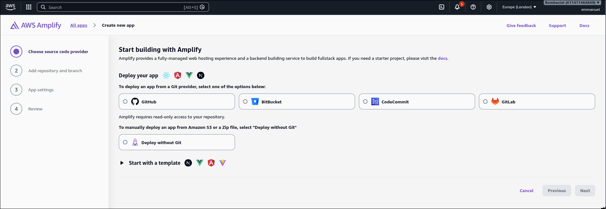
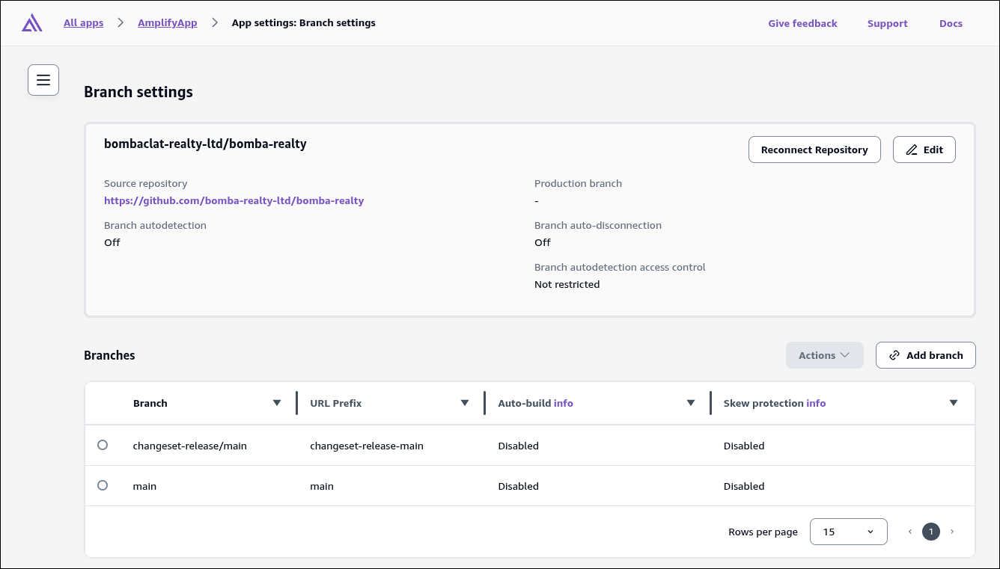
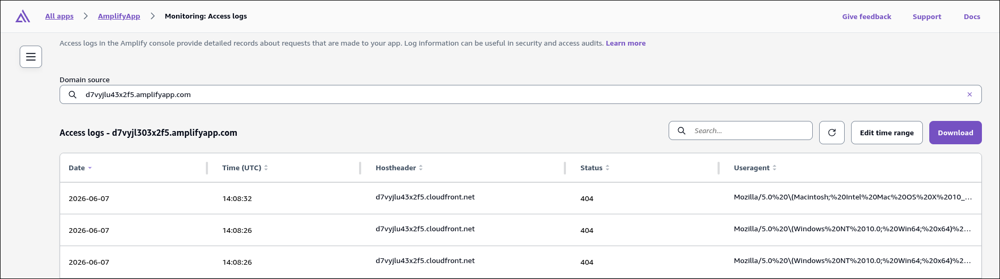
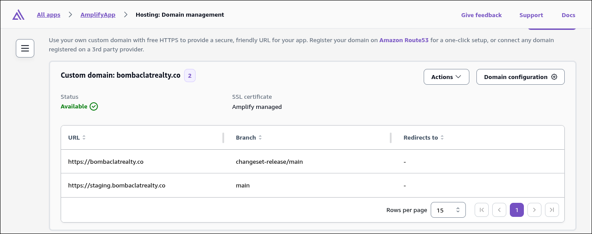
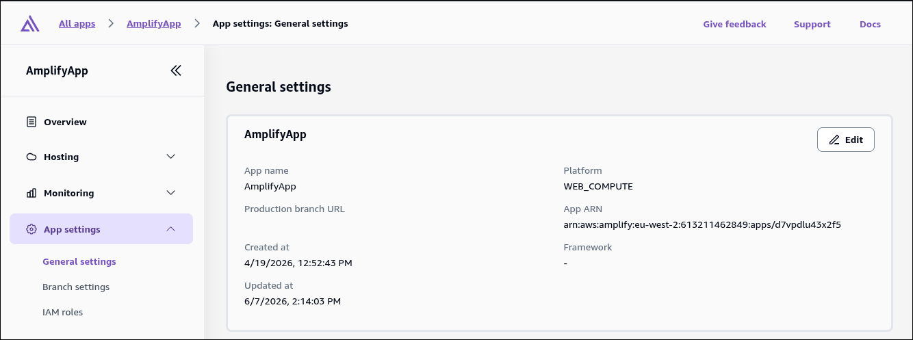
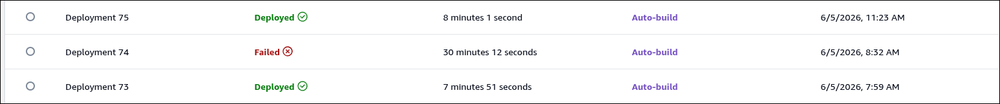

At [Heartbeat](https://heartbeat365.com/), we run everything on AWS - queues, database, object storage, email, DNS, you name it. Everything except our frontend hosting, which, for a long time, lived on Vercel.

Why? Next.js.

If you've worked with Next.js, you know how tightly it's coupled to Vercel. Yes, there's `standalone` mode for Docker, but you lose a lot of the guarantees Vercel gives you, especially if your app is mostly dynamic.

Things like cached content staying in sync across multiple instances, on-demand revalidation via `revalidateTag`, and streaming just working reliably without you thinking about it.

Another alternative if you want to self-host is [OpenNext](https://opennext.js.org/) from the SST team (now [anomaly](https://anoma.ly/)), whose work I genuinely admire. It lets you deploy Next.js anywhere by mapping framework behavior onto provider primitives (AWS, Netlify, Cloudflare, etc.).

But it comes with a catch: you're essentially relying on reverse-engineered behavior against an API that wasn't stable. That implies constant break/fix cycles whenever Next.js changed significantly between major versions.

For us, it wasn't worth the ongoing debugging cost, so we stayed on Vercel.

That changed on March 25th, 2026, when Vercel finally shipped the [Adapter API](https://nextjs.org/blog/nextjs-across-platforms#the-adapter-api). For the first time, there was a documented, stable build output contract, with promises of official adapters for platforms like AWS Amplify and Google Cloud coming later in the year.

That was enough signal for us to initiate the move, so we migrated to Amplify.

We regretted switching. At least the process.

This is our story. The bugs we hit, the workarounds we built, and what we wish we'd known about Amplify before leaving Vercel.

> NOTE: This is not a tutorial. I might omit certain things for simplicity sake of this article. Please always refer to the docs.

## What is AWS Amplify?

[AWS Amplify](https://docs.aws.amazon.com/amplify/latest/userguide/welcome.html) is a managed service for deploying fullstack meta frameworks like Next.js, Nuxt, and SvelteKit. Git-based workflow, continuous deployment, the whole package.

Basically, you can picture it as AWS-flavored Vercel: pull request reviews, skew protection, branch protection, all included.

It supports multiple sources, not just GitHub. Bitbucket, GitLab, CodeCommit, even [manual deployment](https://docs.aws.amazon.com/amplify/latest/userguide/manual-deploys.html) through S3.

## Hosting on Amplify


To deploy on Amplify, you create an Amplify App. That's where most of the project settings live. A few things are required:

1.  Name of the project
2.  Platform enum which could be `WEB` for static apps (HTML/CSS/JSS) or `WEB_COMPUTE` for SSR apps
3.  Repository: For a git provider, you have to grant read-access to Amplify for your repositories. This is done by installing the Amplify GitHub App from the console UI.
4.  An optional personal access token with the `repo` scope if you're deploying programmatically with IaC or CLI for git provider.
5.  An optional IAM service and compute role for Amplify to assume during build/deploy and runtime. One is created by default if you don't provide one.

In all, you can do so with this AWS CLI command:

```shell
aws amplify create-app \
  --name my-app \
  --platform WEB_COMPUTE \
  --repository https://github.com/owner/repo \
  --oauth-token YOUR_GITHUB_PAT \
  --iam-service-role-arn arn:aws:iam::ACCOUNT:role/AmplifyServiceRole # Optional
  --compute-role-arn arn:aws:iam::ACCOUNT:role/AmplifyComputeRole # Optional
```

The above should create your Amplify App and you can navigate to console UI to see it:



After which you can add your git branches so it auto-builds on push:

```shell
aws amplify create-branch \
  --app-id YOUR_APP_ID \ # Gotten from previous command
  --branch-name main \
  --enable-auto-build
```

You can also do this from console UI if you prefer:



And that's it! You've successfully hosted your Next.js app on Amplify 🥳. Push a change, and Amplify auto-pulls it, builds, and deploys it.

If you don't want auto-build behavior, that's fine. You can manually trigger a deployment yourself using the below:

```shell
 aws amplify start-job \
	--app-id "__PLACEHOLDER__" \
	--branch-name "main" \
	--job-type RELEASE
```

All is great. You're now off to the sunsets and happily ever after, right?

At least that's what I thought. The deployment gods were looking over me like Denzel Washington in [Highest 2 Lowest](https://www.imdb.com/title/tt31194612).


In reality, we're nowhere near done. We kept a dirty laundry list of every issue we hit during the transition. Let's go through them.

## Issues with Amplify

Most people think of AWS Amplify as a production-ready service, but IMHO it's not. At least, not with this many issues sitting open and this little support attending to them.

For the issues I'm about to list, most have been open for 2+ years. And one in particular goes all the way back to 2023 and is still unresolved to this today on GitHub.

It's astonishing. The Gen 2 service is 3 years into its lifecycle, yet these issues are still here. At the very least, they should be documented properly.

### Issue #1: SSM Path Mismatch

From the [Amplify docs](https://docs.amplify.aws/nextjs/deploy-and-host/fullstack-branching/secrets-and-vars/#set-secrets), it states specific branch secrets created through AWS Amplify console are stored under a specified SSM path which is true.


But in reality, during the deployment, the runner pulls from the below SSM parameter store path:

```plaintext
/amplify/<app-id>/<branch-name>/<secret-key>
```

not:

```plaintext
/amplify/<app-id>/<branchname>-branch-<unique-hash>/<secret-key>
```

This means when a deployment is started, your application would build successfully and fail during runtime unless you configured build time validation for required environment variables, which you should.

Below are my logs from one of my deployments showing the SSM path:

```bash
2026-04-19T12:40:41.626Z [INFO]: ---- Setting Up SSM Secrets ----
2026-04-19T12:40:41.626Z [INFO]: SSM params {"Path":"/amplify/d7vyjlx53x2f5/main/","WithDecryption":true}
```

That leaves us creating our secrets in SSM manually, not through the Amplify console.

For a first-time user using secrets instead of environment variables, there's no way you'd know this upfront.

Here's its filed [GitHub Issue](https://github.com/aws-amplify/amplify-hosting/issues/3966#user-content-fn-0-7efdcbd57fc7d57824b064ce09c737f9)

### Issue #2: Default Service Role Lacks SSM Permissions

Same story here: remember when I said the IAM service role is optional when creating your amplify app?? Well that's a lie.

The default service role Amplify creates doesn't have the permissions to pull from SSM. So in your deployment logs, it would just silently log a warning and move on.

```plaintext
[WARNING]: !Failed to set up process.env.secrets`
```

And that's before it tries to pull from the wrong documented SSM path the console UI creates.

In AWS CDK, this could easily be fixed like so:

```typescript
const amplifySecretsPathArn = cdk.Stack.of(this).formatArn({
  service: "ssm",
  resource: "parameter",
  resourceName: "amplify/*",
  arnFormat: cdk.ArnFormat.SLASH_RESOURCE_NAME,
});

amplifyAppServiceRole.addToPolicy(
  new iam.PolicyStatement({
    effect: iam.Effect.ALLOW,
    actions: ["ssm:GetParameter", "ssm:GetParameters", "ssm:GetParametersByPath"],
    resources: [amplifySecretsPathArn],
  }),
);
```

### Issue #3: Secrets Are JSON-Stringified

Still on secrets: after fixing the above, you'd expect your app to work and secrets to be available at runtime. Yes, they'll be available, but under a nested "secrets" key which would cause your app to fail.

For most people out there, your app is probably expecting `process.env.MY_SECRET`, but in reality it's under `process.env.secrets.MY_SECRET` (after calling `JSON.parse`).

This leaves you with two options:

1.  Modify your app to conditionally read runtime secrets from `process.env.secrets` for Amplify runtime
2.  Create a custom buildspec if you didn't already have one to export your secrets to an env file. E.g, `.env.production`

The former requires changing your app code which is more demanding, and the latter is bit unsafe if not done properly. By writing to disk, you can potentially leak your secrets to build logs if not careful.

I went with the latter:

```shell
`node -e "Object.entries(JSON.parse(process.env.secrets||'{}')).forEach(([k,v])=>console.log(k+'='+v))" > ${props.appRoot}/.env.production`
```

> Don't try to use `jq`. It's not available in the default runner.

### Issue #4: CDK Default Role Lacks Logging and ACM Permissions

This one I believe is specific to `@aws-cdk/aws-amplify-alpha` package with CDK (I haven't verified so take with a grain of salt)

This ties into the second issue. With the default created role having no policies attached, the default access logs provided by Amplify would throw an error because it lacks IAM permissions to the CloudWatch log group.



The same goes for attaching a custom domain, which would fail when Amplify tries to generate an ACM certificate.



You have to manually attach the required policies or inline the permissions:

```typescript
amplifyAppServiceRole.addToPolicy(
  new iam.PolicyStatement({
    actions: [
      "logs:CreateLogStream",
      "logs:CreateLogGroup",
      "logs:DescribeLogGroups",
      "logs:PutLogEvents",
    ],
    resources: ["*"],
  }),
);

amplifyAppServiceRole.addToPolicy(
  new iam.PolicyStatement({
    effect: iam.Effect.ALLOW,
    actions: ["acm:DescribeCertificate", "acm:ListCertificates", "acm:RequestCertificate"],
    resources: ["*"],
  }),
);
```

Here's the filed [Github Issue](https://github.com/aws/aws-cdk/issues/28986)

### Issue #5: Monorepo Framework Auto-Detection Fails

Amplify [supports apps in monorepos](https://docs.aws.amazon.com/amplify/latest/userguide/monorepo-configuration.html) created with npm workspaces, pnpm workspaces, Yarn, Nx, and Turborepo, which I think it's great.

Most open source projects today are by default monorepos just because the tooling has gotten so good and DX boost is massive.

With Amplify, it's as simple as setting `appRoot` in your buildspec and `AMPLIFY_MONOREPO_APP_ROOT` in your environment variables. They both have to match.

Seems straightforward. But Amplify fails to auto-detect your application framework. You can spot it on the settings page as a "-".



Or fetching branch details:

```typescript
aws amplify get-branch --app-id "__PLACEHOLDER__" --branch-name "main"
```

You'll notice no `framework` key is set in the response.

Honestly, I don't think this is needed today because my app builds fine without it? But I saw some [open issues](https://github.com/aws-amplify/amplify-hosting/issues/4028) where it mattered, so I set it manually anyway, as one of the maintainers suggested.

I mean, what's the worst that could happen? My deployment is already breaking anyway.

```typescript
aws amplify update-branch --app-id "__PLACEHOLDER__" --branch-name "main" --framework 'Next.js - SSR'
```

### Issue #6: No Catalog Support

In a monorepo, you'll typically want to have a single unified version for packages across your workspace. That's where catalogs comes in.

I use pnpm, and catalogs have been around since v9 in 2024. Bun also ships catalogs with its package manager, so it's not fairly a "new thing" per se on the scenes

Long story short, you can already see where this is going. Amplify doesn't support catalogs.


Yeah, I know. How am I surprised.

Here is an [open issue](https://github.com/aws-amplify/amplify-hosting/issues/4037) since 2024 and still hasn't been resolved in 2026.

You can see how tiring it's getting at this point. Issue after issue.

I didn't want to migrate our monorepo away from using catalogs just because Amplify doesn't support it, so I created a [script](https://gist.github.com/Armadillidiid/875fdbe62ce5a67ed13e6191c703be90) to resolve catalogs to their concrete versions. I call this script after installing frozen dependencies, then update the lockfile afterwards.

```plaintext
"pnpm install --frozen-lockfile",
"node --experimental-strip-types scripts/resolve-catalogs.ts",
"pnpm install --lockfile-only",
```

Updating the lockfile afterwards is important, unless pnpm will throw `ERR_PNPM_OUTDATED_LOCKFILE` error for subsequent commands.

### Issue #7: Symlink support

If you use pnpm, you know about the virtual store it create in each project's `node_modules`. Every project gets its own projection of that store, and pnpm hardlinks files from the content-addressable store into the `.pnpm` directory structure.

Amplify properly [documents](https://docs.aws.amazon.com/amplify/latest/userguide/monorepo-configuration.html#turborepo-pnpm-monorepo-configuration) that when you're using pnpm workspaces or Turborepo, you should opt for a flat `node_modules` instead of the default virtual store pnpm uses.

This is fine, but it's a shame because pnpm has a new [`deploy`](https://pnpm.io/cli/deploy) command in v11 that creates a self-contained copy of a workspace package in a target folder. It's very nice for CI/CD as it does pruning, installation and packaging all in one command, so afterwards, you just easily copy the artifacts over to a remote location.

But to do that, it creates a localized virtual store within the deploy directory which uses symlinks, and Amplify doesn't support that.

[GitHub issue](https://github.com/aws-amplify/amplify-hosting/issues/3467)

### Issue #8: Build Output Size Limit

Amplify supports a maximum of 220MB for SSR build output. If your build exceeds it, you get an error message.

This is well [documented](https://docs.aws.amazon.com/amplify/latest/userguide/troubleshooting-SSR.html#build-output-too-large) by Amplfiy on their troubleshooting page. At the time of deployment, my output size was 250 MB (30 MB over the limit).

After debugging, we saw our workspace source maps were taking nearly half of that at 110MB, so I disabled them in my `next-config.ts`:

```json
{
  "productionBrowserSourceMaps": false,
  "experimental": {
    "serverSourceMaps": false
  }
}
```

I probably need to do more debugging, because it shouldn't be that high without source map regardless.

This isn't necessarily an issue, but it's something I thought I should mention.

### Issue #9: Poor Documentation

A good example of this is CDK’s handling of buildspecs. If you use `Buildspec.fromSourceFile` instead of the expected `Buildspec.fromObjectToYaml`, everything typechecks and passes without any linting errors.

The problem only shows up at deploy time, when the generated CloudFormation reveals that the Amplify construct inlines the buildspec as a template string instead of treating it as a proper file reference.

If you were trying to be clever and pass a source file like you do with a CodeBuild project, the filename gets embedded directly as the buildspec reference and the deployment fails.

Skill issue maybe? 😅 Still, a small JSDoc note or README mention would've been nice.

### Issue #10: Transient Network Errors?

Some deployments flat out freeze during `pnpm install` until they time out. If I restart the deployment, it works right after.

I don't know the root cause, but it happens about once in like every 9 deployments.



Our average successful deployment takes about 8 minutes and having 30 minutes billed for a bad deployment every now and then is kinda annoying.

## Conclusion

The transition from Vercel to Amplify was anything but smooth. Issue after issue, workaround after workaround. But ultimately, our app runs fine in the end.

By no means am I trying to dump on the service or the team behind it. I'm just telling our experience doing this transition.

For what people tout to be an alternative to Vercel, it's still far from it. I just feel bad for first-time users like me who have to go through what we did just to host their app.

Looking back, we jumped the gun too early and should've waited for the official adapter at the end of the year.

Regarding runtime stability, our workloads behave the same as on Vercel. We haven't hit anything unexpected there yet, apart from [CloudFront's default limit](https://opennext.js.org/aws/v2/advanced/workaround) of 25 behaviors per distribution for top-level files in `public/`.

Amplify does a decent job documenting what [SSR features](https://docs.aws.amazon.com/amplify/latest/userguide/ssr-supported-features.html) are and aren't supported, so nothing has come up as a surprise.

Here's our [CDK amplify construct](https://gist.github.com/Armadillidiid/2d3cd57db2c291fec27c0a5ec14f9e45) we currently use at the moment if you care for that. I hope you found this article useful!
